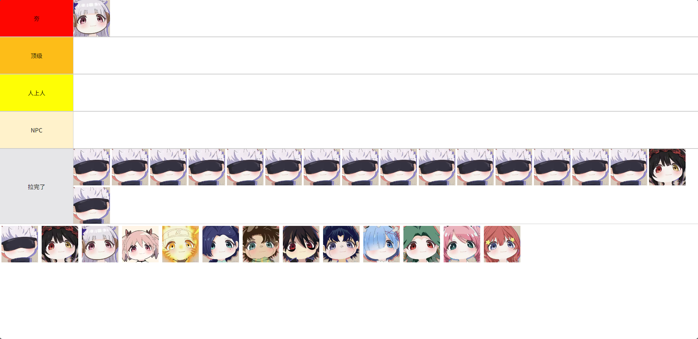

# 从夯到拉排行

预览图   

使用方法：   
克隆项目或下载压缩包到本地后解压；   
双击index.html文件，在浏览器打开网页；   
将图片放到【imgs】目录，在index.html文件中的availableImages中添加文件名；   
在网页中将图片拖拽到对应容器，点击容器的图片可以移除；   

## ⚠️ 仓库说明
本项目**主仓库位于 Gitee**，GitHub 为自动单向同步的只读镜像。

1. 你可以自由 Fork GitHub 上的代码副本，但所有代码提交、Bug反馈、功能建议、Pull Request，请前往 Gitee 主仓库。
2. GitHub仓库所有文件由Gitee自动同步覆盖，任何在此处的手动修改都会丢失。

👉 Gitee主仓库地址：https://gitee.com/miaoaa66/ranking-from-ramming-to-pulling
