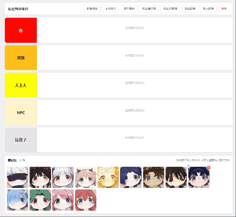

# 从夯到拉排行

一个纯前端、免构建的图片排行（Tier List）小工具。把图片拖进不同等级的分组，做成你自己的「从夯到拉」榜单。

预览图



## 功能特性

- **分组可配置**：分组的名称、颜色、数量、顺序都能在页面上直接改，不用动代码。
- **图片可上传**：点击「上传图片」选择本地图片，或直接把图片文件从桌面拖进素材区；素材可删除、可一键清空。
- **拖拽编排**：素材拖进分组、分组之间互相移动、分组内自由排序、还能把图片拖回素材区；拖动时显示插入位置指示线。
- **自动保存**：所有改动自动存到浏览器本地（localStorage），刷新或下次打开会自动恢复。
- **导出分享**：可把榜单导出为 PNG 图片（支持只导排行区或连素材区一起导），也可导出/导入 JSON 配置用于备份或迁移。
- **一键重置**：随时恢复成默认的 5 个分组与 13 张素材。

## 使用方法

1. 克隆项目或下载压缩包到本地后解压。
2. 双击 `index.html` 文件，在浏览器中打开网页。
3. 从下方「素材区」把图片拖到上方对应的分组里即可。
4. 需要自定义时：
   - 点击「配置模式」，可修改分组名称与颜色、上移/下移、删除分组、新增分组。
   - 点击「上传图片」添加自己的图片（也可从桌面直接拖入素材区）。
   - 图片右上角的 `×` 用于把图片移出分组或从素材区删除。
5. 完成后点击「导出排行图」或「导出完整图」保存为 PNG，或用「导出配置」备份数据。

### 关于导出图片

工具栏提供两个导出按钮：

- **导出排行图**：只导出上方的分组排行区域，不含素材区，适合直接分享榜单。
- **导出完整图**：导出分组排行 + 下方素材区。

两者都会自动隐藏工具栏、删除按钮、空状态提示等交互控件，导出结果干净，无需手动处理。

注意：如果是以双击方式（`file://`）打开页面，浏览器的安全限制可能导致导出的图片缺失或失败。此时请改用本地服务器打开，例如在项目目录下执行：

```bash
python -m http.server 8000
```

然后访问 `http://localhost:8000`，再执行导出。

## 数据存储说明

榜单数据保存在浏览器的 localStorage（键名 `ranking-from-ramming-to-pulling:v1`）中：

- 换浏览器、换电脑、或清理浏览器缓存后，数据不会自动带过去。
- 上传的图片会被压缩后存入本地存储，受浏览器约 5MB 配额限制；空间不足时会提示，此时上传的图片仅本次会话有效。
- 重要榜单建议用「导出配置」保存一份 JSON 文件，需要时用「导入配置」恢复。

## 目录结构

```
├── index.html                  页面（含样式与 Vue 应用逻辑）
├── imgs/                       默认素材图片
└── static/
    ├── vue.global.prod.js      Vue 3 全局构建版（本地引入，离线可用）
    ├── html2canvas.min.js      导出图片功能依赖
    └── preview.png             README 预览图
```

## ⚠️ 仓库说明
本项目**主仓库位于 Gitee**，GitHub 为自动单向同步的只读镜像。

1. 你可以自由 Fork GitHub 上的代码副本，但所有代码提交、Bug反馈、功能建议、Pull Request，请前往 Gitee 主仓库。
2. GitHub仓库所有文件由Gitee自动同步覆盖，任何在此处的手动修改都会丢失。

👉 Gitee主仓库地址：https://gitee.com/miaoaa66/ranking-from-ramming-to-pulling
